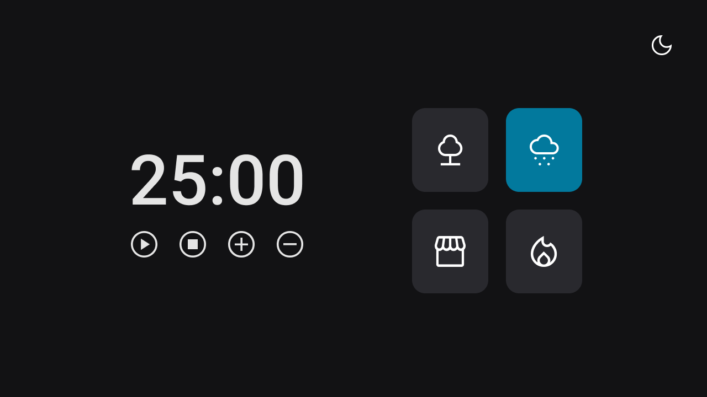
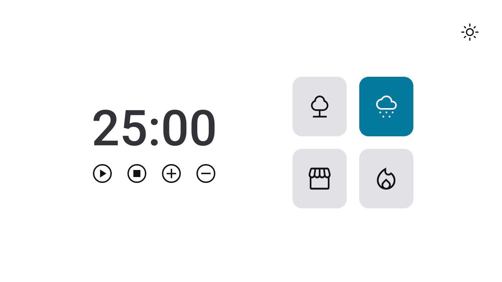
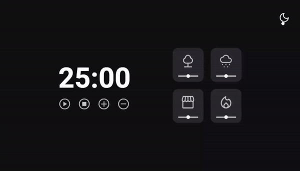

  

   
   

  

    <a href="#-projeto">Desafio</a>&nbsp;&nbsp;&nbsp;|&nbsp;&nbsp;&nbsp;
    <a href="#-tecnologias">Tecnologias</a>&nbsp;&nbsp;&nbsp;|&nbsp;&nbsp;&nbsp;
    <a href="#-layout">Layout</a>&nbsp;&nbsp;&nbsp;|&nbsp;&nbsp;&nbsp;
    <a href="#-contato">Contato</a>
  

  
  

## Sobre o desafio

Projeto realizado como desafio para criação de Pomodoro Timer, no qual o usuário pode além de usar o contador, também escutar músicas relaxantes. Cada card que se encontra do lado direito, quando selecionado, vai mudar de cor e emitir um som diferente.

* Floresta
* Chuva
* Cafeteria
* Lareira

  
Funcionalidades esperadas dos botões:
* Play: aciona o timer;
* Stop: para o timer;
* Mais: aumenta em mais 5 minutos o tempo do timer;
* Menos: diminui em 5 minutos o tempo do timer.

## Tecnologias
- HTML
- CSS
- JavaScript
- Figma

## Layout do projeto
<table>
  <tr>
    <td></td>
    <td></td>
  </tr> 
</table>

## Demonstração
Aqui está uma prévia do resultado final do desafio desenvolvido
[Link Demonstração](https://joao-sillva.github.io/FocusTimer-v2/)

## Contato
Se você tiver alguma dúvida ou quiser entrar em contato, você pode me enviar uma mensagem pelo
[LinkedIn](https://www.linkedin.com/in/joao-sillva/).

(<a href="#readme-top">voltar ao topo</a>)

